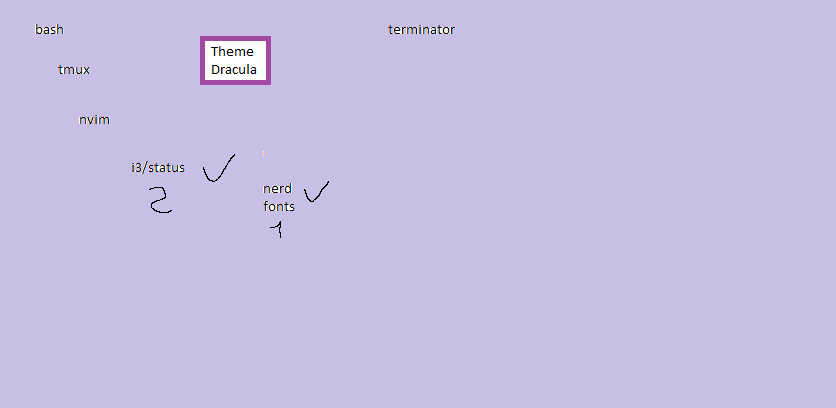

# I choose dracula as a teme for every thing

<https://draculatheme.com>

## i3

class                 border  bground text    indicator child_border

client.focused          #6272A4 #6272A4 #F8F8F2 #6272A4   #6272A4
client.focused_inactive #44475A #44475A #F8F8F2 #44475A   #44475A
client.unfocused        #282A36 #282A36 #BFBFBF #282A36   #282A36
client.urgent           #44475A #FF5555 #F8F8F2 #FF5555   #FF5555
client.placeholder      #282A36 #282A36 #F8F8F2 #282A36   #282A36

client.background       #F8F8F2

bar {
  colors {
    background #282A36
    statusline #F8F8F2
    separator  #44475A

    focused_workspace  #44475A #44475A #F8F8F2
    active_workspace   #282A36 #44475A #F8F8F2
    inactive_workspace #282A36 #282A36 #BFBFBF
    urgent_workspace   #FF5555 #FF5555 #F8F8F2
    binding_mode       #FF5555 #FF5555 #F8F8F2
  }
}

bindsym $mod+d exec "dmenu_run -nf '#F8F8F2' -nb '#282A36' -sb '#6272A4' -sf '#F8F8F2' -fn 'monospace-10' -p 'dmenu%'"

## i3 staus

general {
  output_format = "i3bar"
  colors = true
  color_good = "#50FA7B"
  color_degraded = "#F1FA8C"
  color_bad = "#FF5555"
}

## Terminator

git clone <https://github.com/dracula/terminator.git>

cd terminator

./install.sh

## Tmux

set -g @plugin 'dracula/tmux'

run -b '~/.tmux/plugins/tpm/tpm'

prefix + I

## Bash

su +bashrc.sh
